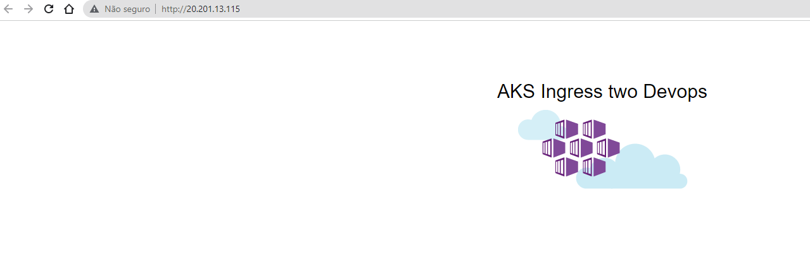

- ✨Magic ✨

# Instalação multiplos ingress nginx externos.
## Documentação official

[artifacthub.io ](https://artifacthub.io/packages/helm/ingress-nginx/ingress-nginx#install-chart)

[kubernetes.github.io ](https://kubernetes.github.io/ingress-nginx/user-guide/multiple-ingress/#using-ingressclasses) 


## Kubernetes version 1.21.7
A partir do NGINX IC v1.8.0 , é possível instalar vários controladores de entrada NGINX em um cluster Kubernetes.

## Pré-requisitos
Chart version 3.x.x: Kubernetes v1.16+
Chart version 4.x.x and above: Kubernetes v1.19+

## Instalar o repo ingress-nginx
```shell
helm repo add ingress-nginx https://kubernetes.github.io/ingress-nginx
helm repo update
```

## Verificar os possiveis parâmetros da instalação ingress-nginx/ingress-nginx via helm
```shell
helm show values ingress-nginx/ingress-nginx  ou helm show values ingress-nginx/ingress-nginx > values.yaml
```
## Deploy de multiplos ingress-nginx explicação

> obs : durante a instalação dos ingress via helm foram passados dois arquivos com seus devidos valores um para cada ingress

```shell
01-values.yaml
```

```shell
controller:
  ingressClassResource:
    name: internal-nginx-01  # default: nginx
    enabled: true
    default: false
    controllerValue: "k8s.io/internal-ingress-nginx-01"  # default: k8s.io/ingress-nginx
```

```shell
02-values.yaml
```

```shell
controller:
  ingressClassResource:
    name: internal-nginx-02  # default: nginx
    enabled: true
    default: false
    controllerValue: "k8s.io/internal-ingress-nginx-02"  # default: k8s.io/ingress-nginx
```    
## Instalando multiplos ingress em namespace diferentes
```shell
helm install nginx-controller-01 -f 01-values.yaml ingress-nginx/ingress-nginx --create-namespace --namespace nginx-controller-01 --version 4.0.13
```

```shell
helm install nginx-controller-02 -f 02-values.yaml ingress-nginx/ingress-nginx --create-namespace --namespace nginx-controller-02 --version 4.0.13
```
## Verificar as implantações


```shell
helm list -A
```

> Output 
```shell
NAME                    NAMESPACE               REVISION        UPDATED                                 STATUS          CHART                   APP VERSION
nginx-controller-01     nginx-controller-01     1               2022-02-06 16:44:04.6783567 -0300 -03   deployed        ingress-nginx-4.0.16    1.1.1      
nginx-controller-02     nginx-controller-02     1               2022-02-06 16:44:30.8783603 -0300 -03   deployed        ingress-nginx-4.0.16    1.1.1      
```
## Deploy de aplicação em ingress-nginx nginx-controller-01

```shell
kubectl apply -f app_one.yaml 
```

```shell
deployment.apps/aks-helloworld-one created
service/aks-helloworld-one created
ingress.networking.k8s.io/hello-world-ingress created
```


## Deploy de aplicação em ingress-nginx nginx-controller-02
```shell
kubectl apply -f app_two.yaml 
```

```shell
deployment.apps/aks-helloworld-two created
service/aks-helloworld-two created
ingress.networking.k8s.io/hello-world-ingress configured
```



## Resultado sera algo como voce ver nessa imagen abaixo;


## Removendo todos ingress criados:
```shell
helm uninstall nginx-controller-01 -n nginx-controller-01 && helm uninstall nginx-controller-02 -n nginx-controller-02
```
